# Systems Cartography Portfolio

A self-hosting developer portfolio that turns a GitHub account, a professional
profile, and repository-derived technical evidence into an **interactive systems
topology**.

It is not a hardcoded personal site. It is a portfolio *system*: fork it, point
it at your own GitHub identity and LinkedIn/CV export, and it binds itself to
you — ingesting your profile, deriving repository-backed project and capability
evidence, and rendering all of it as a navigable map of systems instead of a
list of links.

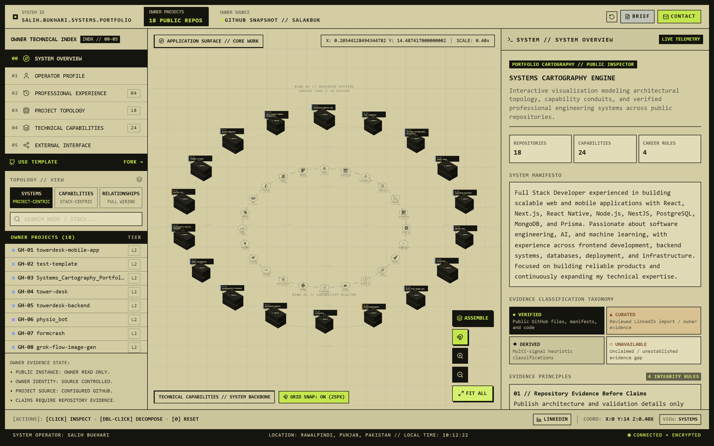

*Public repositories orbit as deployed systems (outer ring); technologies
synthesized from those repositories orbit as capability nodes (inner reactor).
Every panel is labeled `VERIFIED`, `DERIVED`, `CURATED`, or `UNAVAILABLE` so a
visitor can tell GitHub-checkable fact from owner assertion.*

## What you get

- **Interactive deployed-systems topology** — your repositories laid out as a navigable map of systems, not a list.
- **Capability reactor / tech stack view** — technologies synthesized from your repositories' actual languages, dependencies, and topics, orbiting as inspectable capability nodes.
- **Project architecture inspector** — per-repository problem/solution/subsystems/key-decisions view, generated from repository metadata and (optionally) your own reviewed notes.
- **GitHub-derived capabilities** — capability nodes are computed from what your repositories actually contain, not hand-picked from a resume.
- **Professional experience** — imported from a LinkedIn PDF export, with support for progression/promotion within an organization and persistent curated evidence overlays.
- **Evidence provenance** — every claim on the site is labeled `VERIFIED`, `DERIVED`, `CURATED`, or `UNAVAILABLE` so a visitor can tell what is GitHub-verifiable metadata versus what the owner has personally attested to.
- **Static, self-hosted deployment** — the built site is plain static assets (Vite output); no server, no database. One optional serverless function (`/api/github-live`) adds live repository sync where the host supports it (Vercel); without it the site still runs entirely from the committed snapshot.
- **Committed snapshot is the source of truth, live GitHub is progressive enhancement** — the GitHub snapshot is generated once at setup time and committed and always renders immediately. On a functions-capable host the deployed site also calls its OWN same-origin `/api/github-live` endpoint once after load to reflect the *current* public repository membership (repos created / renamed / deleted / archived / made private). The visitor browser never calls GitHub directly; a rate limit, outage, or offline visitor simply falls back to the committed snapshot. See [Live GitHub sync](#live-github-sync).

## From Setup to Systems Map

Configuration happens once, locally, through an interactive wizard
(`npm run setup:portfolio`) that walks
`00 WELCOME → 01 PROFILE → 02 GITHUB → 03 FLAGSHIPS → 04 REVIEW → 05 VERIFY → 06 COMPLETE`.
A freshly forked repository starts from a genuinely unconfigured baseline — the
previous owner's committed data is inert until you complete setup for your own
identity.

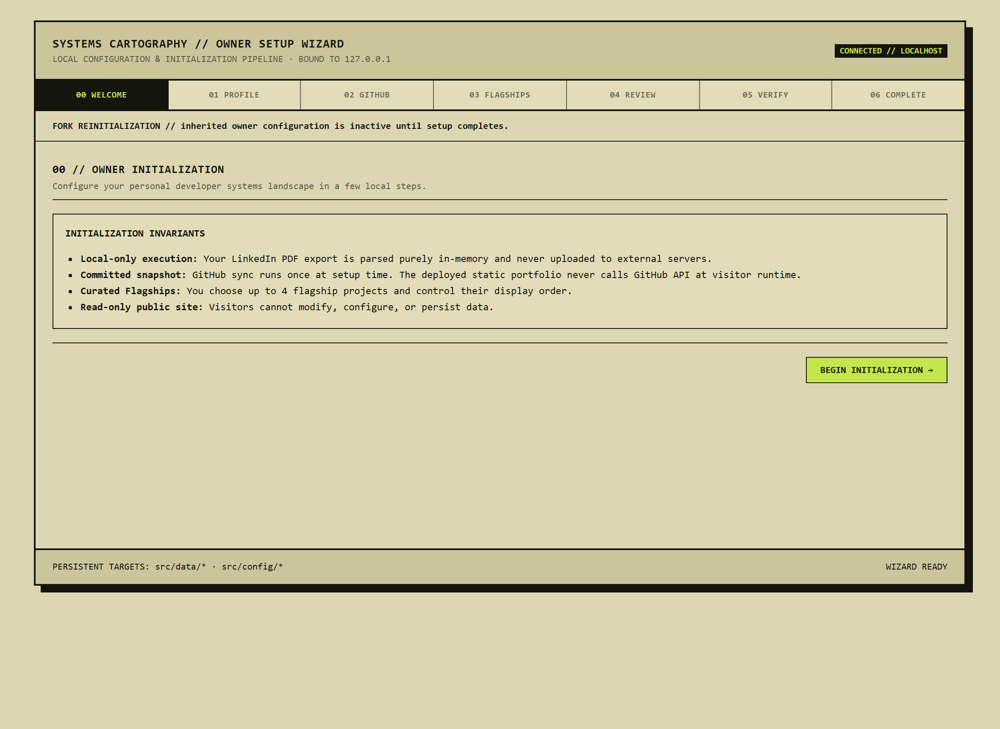

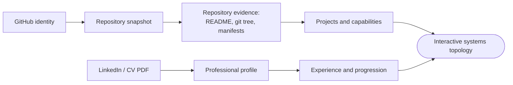

### 1. Bind your GitHub identity

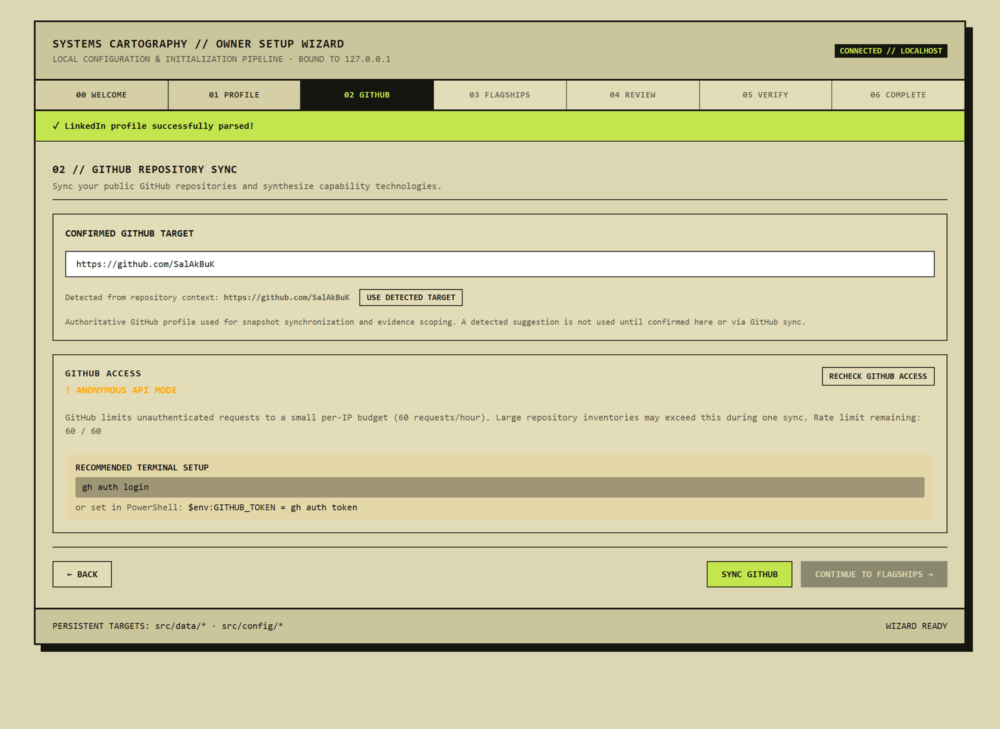

The wizard accepts a GitHub username, an `owner/repo` target, or a full GitHub
URL and canonicalizes it to a single portfolio-owner identity. A target detected
from your fork's git remote is offered as a suggestion but is never used until
you confirm it. GitHub access runs anonymously by default; setting
`GITHUB_TOKEN` / `GH_TOKEN` raises the sync rate limit but is optional.

### 2. Synchronize repositories

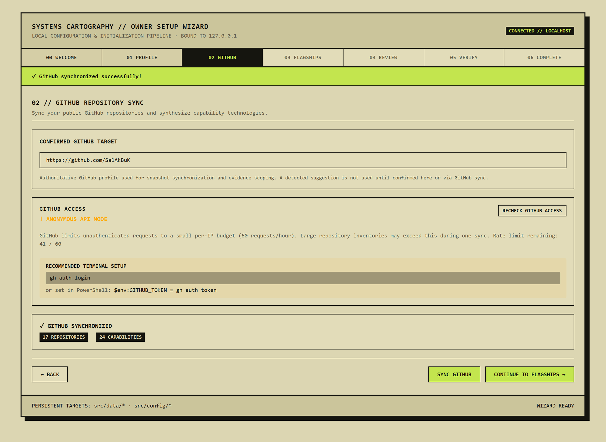

The sync discovers your public repositories, filters to eligible non-fork
projects, canonicalizes repository clusters, deep-inspects each one (README, git
tree, bounded dependency manifests), and synthesizes a committed snapshot of
projects **and** the capability technologies detected across them. This deep
inspection only ever runs here, at setup time — a deployed instance's optional
live sync ([below](#live-github-sync)) reads only lightweight repository
membership + metadata, never per-repository source.

### 3. Import professional context

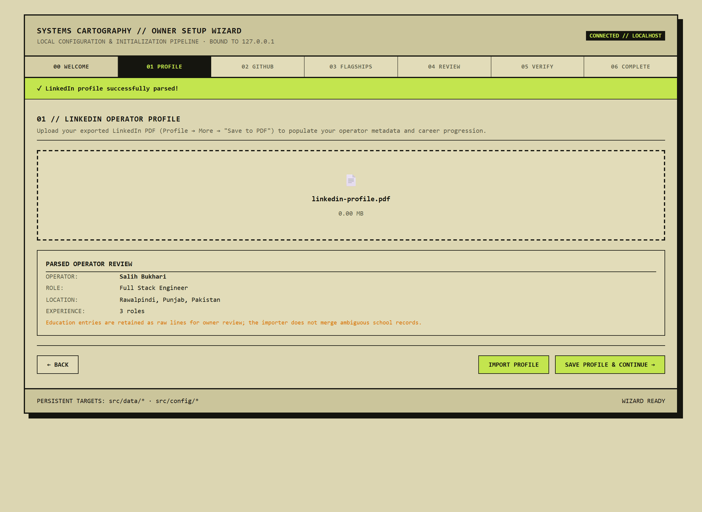

Point the importer at a LinkedIn "Save to PDF" export (or any CV PDF with a
comparable layout). It is parsed **locally, in memory** — the PDF is never
uploaded or committed — to populate identity, location, education, and an
employment history with promotion/progression detection. Ambiguous fields are
surfaced as review warnings rather than guessed.

### 4. Select flagship systems

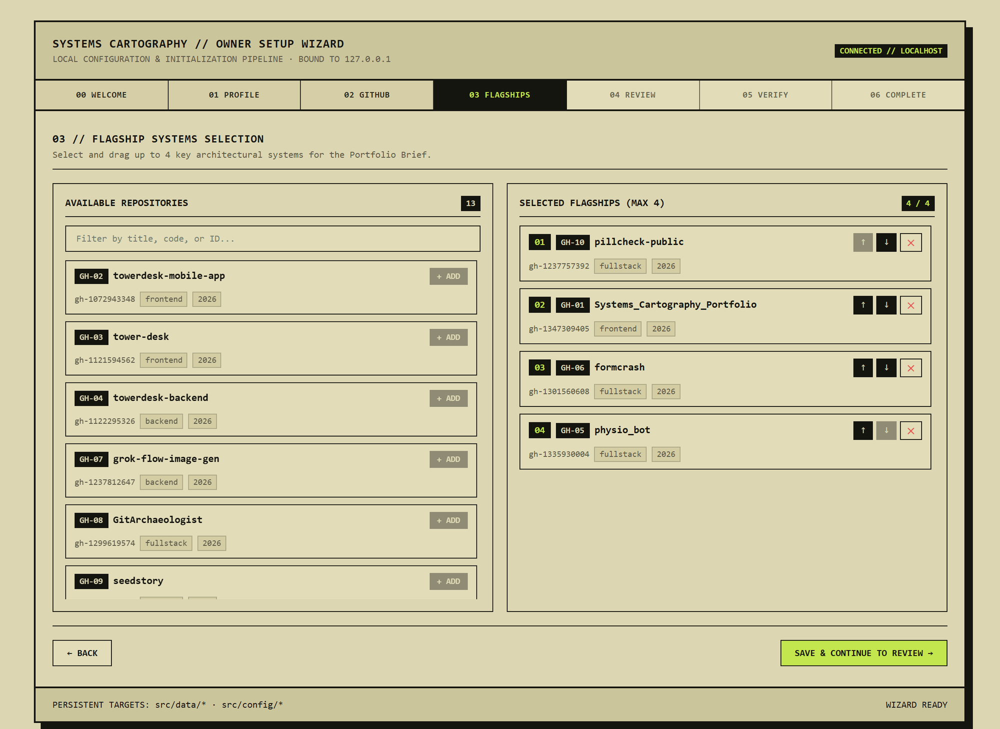

Choose up to four repositories to feature prominently in the Portfolio Brief and
control their order. Everything else still appears in the topology; flagships
just get top billing.

### 5. Verify and complete

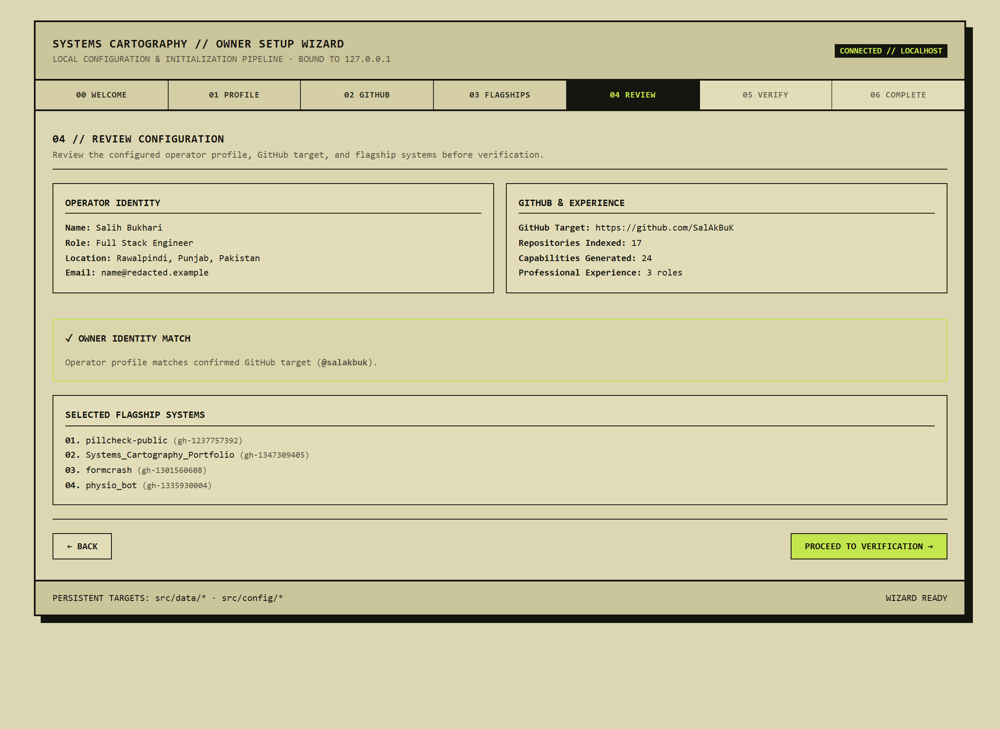

The `REVIEW` step shows the generated identity, GitHub target, capability and
experience counts, and an owner-identity match check before anything is
finalized. `VERIFY` then runs deterministic owner-setup diagnostics
([see the full check list](docs/screenshots/07b-verify-diagnostics.png)) — a
blocking failure prevents completion.

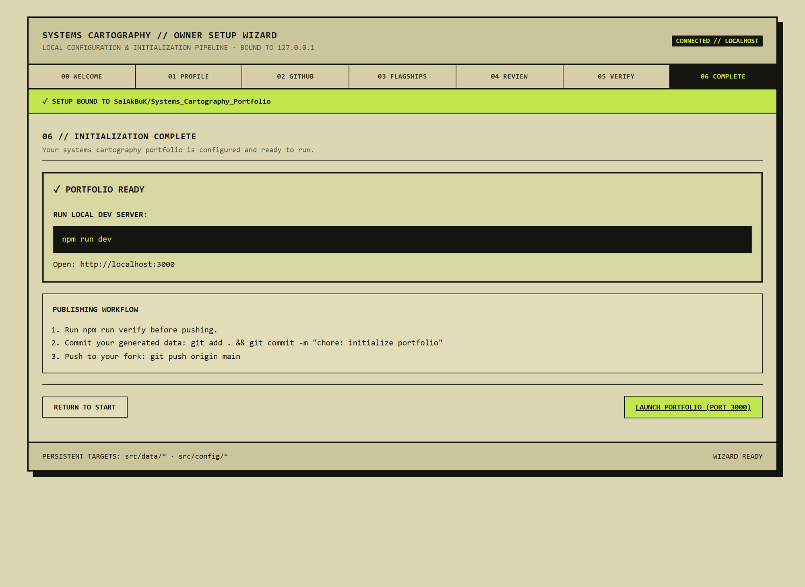

`COMPLETE` binds the setup to this repository's identity. A production build
stays blocked on any fork that still carries a different repository's manifest.

### 6. Explore the resulting topology

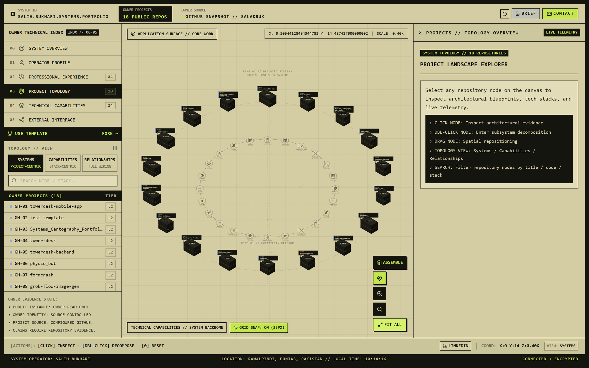

## What the Portfolio Shows

### Systems topology


Every public repository is a node on a spatial workplane. Switch the topology
between **Systems** (project-centric), **Capabilities** (stack-centric), and
**Relationships** (full wiring); pan, zoom, search, and fit-to-view. Nothing here
is a mockup — the layout is driven entirely by the committed snapshot.

### Repository-backed project inspector

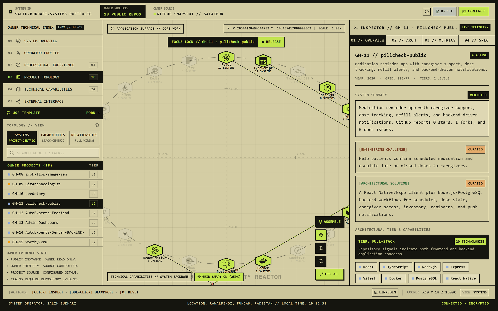

Select a node to focus-lock it: the inspector shows the repository summary,
detected tier, and the exact capability nodes it wires to, with each block
tagged by how the engine knows it (`VERIFIED` from repository metadata,
`CURATED` from owner-reviewed notes).

### Architecture and technical evidence

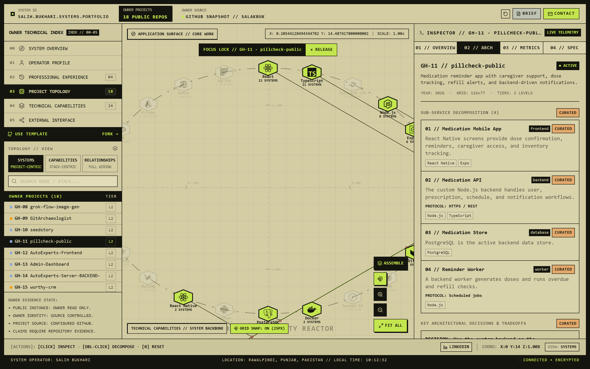

The architecture tab renders sub-service decomposition, protocols, and key
architectural decisions for repositories that have a reviewed
`repositoryEvidence.ts` entry. Repositories without one show only what generic
analysis can support — an explicit evidence gap instead of an invented diagram.

### Professional experience

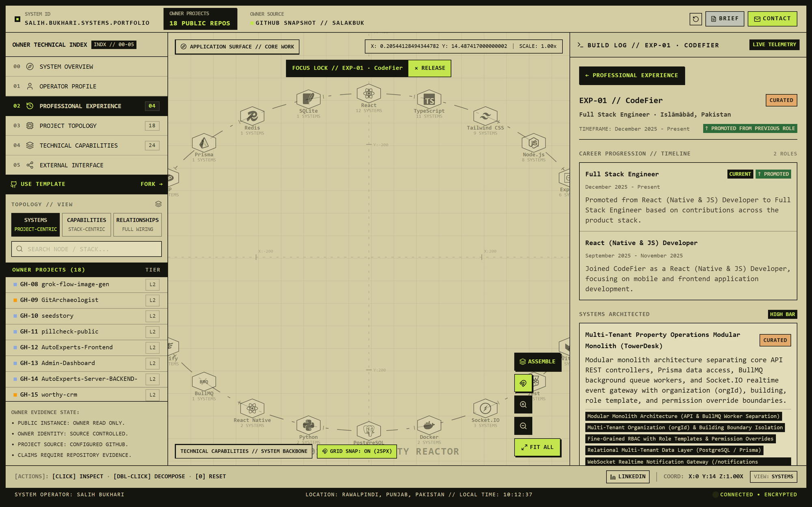

Roles are grouped into organization progressions with promotion detection.
Curated evidence overlays connect an employer to the specific systems delivered
there and back to the matching repositories in the topology.

### Technical capabilities

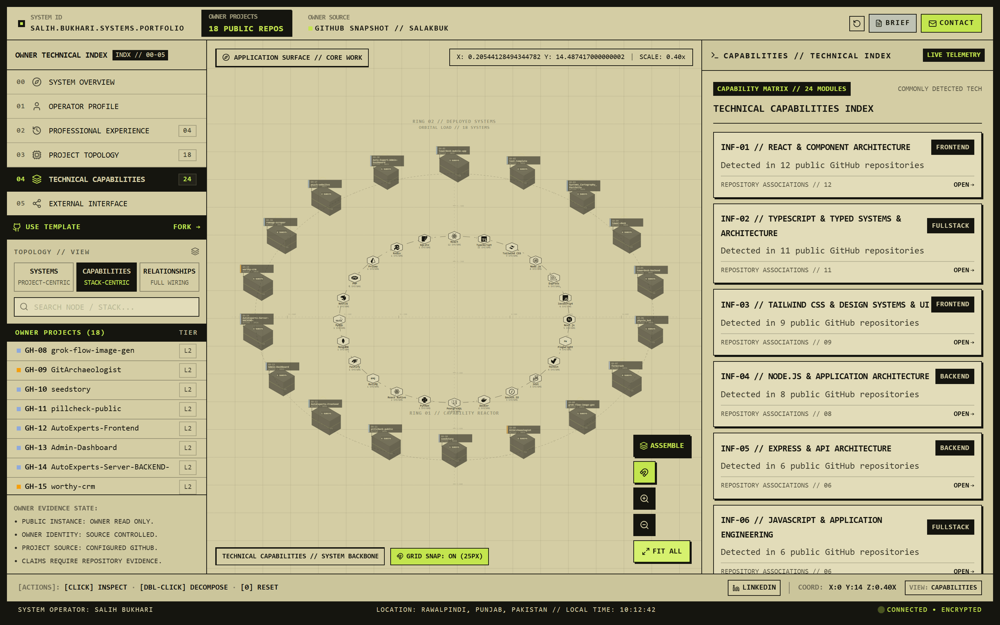

The capability matrix is ranked by how many of your repositories each technology
appears in — "Detected in N public GitHub repositories" — never by a
self-assigned proficiency score.

### Responsive

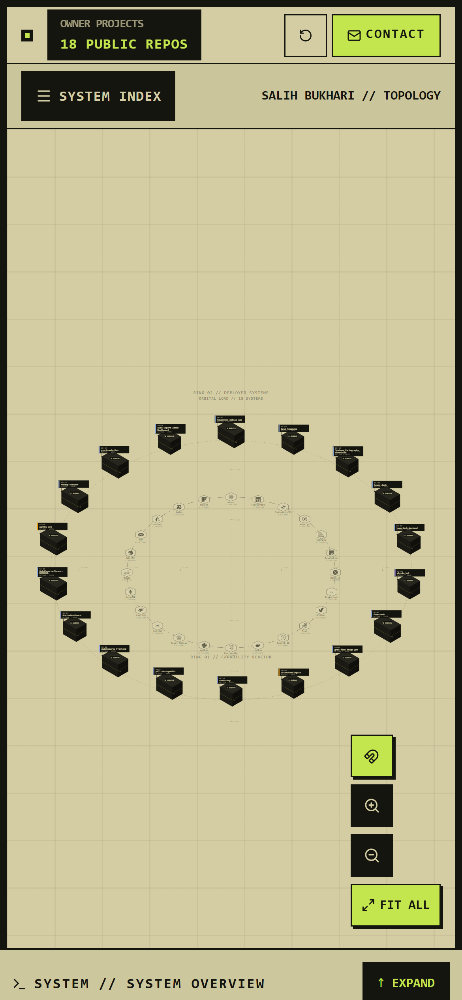

The same topology, inspector, and navigation adapt to a phone-sized viewport.

## Quick owner setup

The fastest way to configure your fork is the local interactive setup wizard:

```bash
git clone https://github.com/<your-username>/Systems_Cartography_Portfolio.git
cd Systems_Cartography_Portfolio
npm install
npm run setup:portfolio
```

Follow the local browser wizard:

```text
00 WELCOME → 01 PROFILE → 02 GITHUB → 03 FLAGSHIPS → 04 REVIEW → 05 VERIFY → 06 COMPLETE
```

Then start the portfolio:

```bash
npm run dev
npm run build
```

Production builds are intentionally blocked until this fork has completed the
wizard's `VERIFY` and `COMPLETE` steps. The completed setup is bound to the
fork's repository identity, so copied upstream owner data cannot authorize a
deployment by itself.

> **Windows note:** the commands above are the same on every platform. If your
> PowerShell execution policy blocks the `npm.ps1` shim, use `npm.cmd` instead
> (`npm.cmd install`, `npm.cmd run setup:portfolio`, …).

---

## Detailed / manual setup

Advanced users or CI environments can also run each setup step individually:

1. **Export your LinkedIn profile to PDF** (LinkedIn profile page → "More" → "Save to PDF") and save it somewhere local. `imports/` is convenient and `imports/*.pdf` is already gitignored.
   ```bash
   # macOS / Linux / Git Bash
   mkdir -p imports
   ```
   ```powershell
   # Windows PowerShell
   New-Item -ItemType Directory -Force -Path imports
   ```
2. **Run the one-time profile importer.** It reads the PDF locally, infers your GitHub target from your fork's git remote (or asks you), and shows a review gate before writing anything.
   ```bash
   npm run setup -- ./imports/linkedin-profile.pdf
   ```
3. **Generate the committed GitHub repository snapshot** for your account.
   ```bash
   npm run sync:github
   ```
4. **Configure your flagship systems (optional).** Launch the local-only interactive configurator to drag and choose up to 4 key architectural flagship projects displayed in the Portfolio Brief.
   ```bash
   npm run setup:flagships
   ```
5. **Run the owner-setup diagnostic** to confirm everything is configured and scoped correctly.
   ```bash
   npm run setup:check
   ```
   If these manual steps are being used in a new fork, finish in
   `npm run setup:portfolio` and complete `VERIFY` then `COMPLETE`. Only the
   verified wizard completion updates the repository-bound setup manifest.
6. **Run it locally.**
   ```bash
   npm run dev
   ```
   Open `http://127.0.0.1:3000`.
7. **Verify before you ship.**
   ```bash
   npm test
   npm run lint
   npm run build
   # or, all at once:
   npm run verify
   ```
8. **Deploy** the built static site — see [Deployment](#deployment) below.

## Requirements

- **Node.js and npm** (Node 18+ recommended; the project uses Vite 6 and native ESM).
- **Git**, and a GitHub account whose repositories you want mapped.
- **A LinkedIn PDF export** is required to populate `src/data/ownerProfile.generated.ts` with your identity and employment history. Without running `npm run setup`, the site falls back to whatever is already committed in that file (the current owner's data, if you have not run setup yet) — running setup is how you replace it with your own.

## How owner data works

This is the most important thing to understand before customizing your fork. Owner-related data in this repository falls into three buckets:

**Generated owner data** — overwritten every time you re-run the corresponding tool:
- `src/data/ownerProfile.generated.ts` — written by `npm run setup` (the LinkedIn importer).
- `src/data/githubSnapshot.generated.ts` — written by `npm run sync:github`.

**Persistent owner-curated data** — never touched by `setup` or `sync:github`; you edit these by hand or through setup tools and they survive re-imports:
- `src/config/ownerPreferences.ts` — curated flagship project display order for the Portfolio Brief (managed via `npm run setup:flagships`).
- `src/data/ownerAdditionalExperience.ts` — professional history that isn't on LinkedIn (freelance work, private client engagements).
- `src/data/ownerExperienceEvidence.ts` — structured engineering evidence attached to an employer (systems delivered, architecture decisions, infrastructure operations).
- `src/data/repositoryEvidence.ts` — reviewed architecture notes for specific repositories, overlaid on top of generic repository analysis.
- `src/config/portfolioConfig.ts` → `projectLinks` — manual live-deployment URL overrides.

**Generic engine code** — everything else: the topology renderer, the capability reactor, the repository analyzer, the experience resolver, the GitHub sync pipeline. This code contains no owner-specific assumptions or hardcoded identities.

### Owner scoping

Every persistent owner-curated data source above declares its own GitHub owner target (for example, `REPOSITORY_EVIDENCE_OWNER_GITHUB_TARGET` in `repositoryEvidence.ts`). The centralized utility in `src/utils/ownerScope.ts` compares that declared owner against your **configured** portfolio owner (`PORTFOLIO_CONFIG.githubTarget`, derived from `ownerProfile.generated.ts`).

Curated data is only ever applied when the two match. Concretely:

- If you fork this repository and run `npm run setup` with your own LinkedIn PDF and GitHub account, the curated evidence files still on disk (still describing the previous owner) become **inert** — the generic resolvers detect the owner mismatch and skip them entirely. Your portfolio will not show someone else's projects, employers, or architecture notes.
- This holds even under name collisions: if your own employer happens to be named the same as an evidence entry already on disk, or one of your repositories happens to share a name with a curated repository entry already on disk, owner identity — not name — decides whether the evidence applies. Evidence identity is **OWNER + REPOSITORY** (or **OWNER + ORGANIZATION**), never the name alone.
- Generic, GitHub-metadata-derived analysis (languages, topics, dependency manifests, inferred category, capability synthesis) always runs for every repository, regardless of owner — only the *curated overlay* is owner-gated. You still get a fully populated portfolio from your own repositories with zero manual curation.

Run `npm run setup:check` any time to see exactly which curated data sources are active for your configured owner and which are present on disk but safely ignored.

## Customization guides

### Add architecture evidence

`src/data/repositoryEvidence.ts` maps a repository name to reviewed problem/solution/subsystems/key-decisions notes. See `docs/examples/repositoryEvidence.example.ts` for the shape to follow. Only write what you can support by having actually reviewed the repository — this data is shown with `CURATED` provenance, meaning "the owner asserts this," not "the engine verified this." Declare your own `REPOSITORY_EVIDENCE_OWNER_GITHUB_TARGET` at the top of the file so this evidence is correctly scoped to you.

If you have multiple repositories that represent one logical project (a sanitized public mirror of a private original, a rename, a monorepo split), add an alias to `REPOSITORY_CANONICAL_CLUSTERS` in the same file.

### Add freelance/private work

Not all professional work has a public GitHub repository, and that's fine — this engine does not force every credential to be GitHub-backed.

- `src/data/ownerAdditionalExperience.ts` — add an `ExperienceNode` for work that doesn't appear on your LinkedIn export (freelance clients, pre-LinkedIn history). This merges with your imported LinkedIn experience and survives re-running `npm run setup`.
- `src/data/ownerExperienceEvidence.ts` — attach structured evidence (systems delivered, architecture, infrastructure operations, evidence links) to an employer/organization by id or name.

**CURATED vs VERIFIED**: `VERIFIED` means the engine derived a fact directly from repository metadata or source (languages, dependencies, test frameworks — things it can check). `CURATED` means the portfolio owner explicitly asserted it (professional attribution, a production deployment schedule, private-client work with no public repository). Both are honestly labeled; neither is invented.

### Add live project links

`src/config/portfolioConfig.ts` → `projectLinks` maps a repository name to a live deployment URL. This overrides the repository's GitHub-reported Website/Homepage field. If neither is set, the UI simply omits the live-system link — it never fabricates one.

### Contact form

The contact page always shows your configured email address directly. Without a configured endpoint, submitting the form opens the visitor's own mail client. To deliver form submissions through a hosted endpoint (e.g. Formspree), set:

```env
VITE_CONTACT_FORM_ENDPOINT=https://formspree.io/f/your-form-id
```

**Never put SMTP passwords, API keys, or private credentials in a `VITE_` variable** — Vite inlines those values into the client-side JavaScript bundle, so they are visible to anyone who views the page source. Use a hosted form endpoint or a serverless function that keeps real secrets server-side. The contact form includes a hidden honeypot field, but the receiving endpoint should still apply its own rate limiting and abuse protection.

### Update your portfolio

Re-running the setup tools is safe and expected as your profile changes. What gets overwritten and what persists:

| Command | Overwrites | Persists |
|---|---|---|
| `npm run setup -- <pdf>` | `src/data/ownerProfile.generated.ts` (identity, LinkedIn-imported employment history) | Everything in `ownerAdditionalExperience.ts`, `ownerExperienceEvidence.ts`, `repositoryEvidence.ts`, `portfolioConfig.ts` |
| `npm run sync:github` | `src/data/githubSnapshot.generated.ts` (repository list, languages, generic capability synthesis) | Your curated `repositoryEvidence.ts` overlays (re-applied on the next sync since they key off repository name + your owner target) |

Neither command deletes or rewrites your persistent curated files. There is no automatic "reset" of curated data — if you want to remove or replace curated evidence, edit those files directly.

Always run `npm run setup:check` after re-running either tool to confirm the owner target still matches everywhere and nothing curated silently went stale.

## Deployment

The production build (`npm run build`) is a static site in `dist/` — deploy it to any static host.

Before Vite emits production assets, the build compares
`src/config/ownerSetup.generated.ts` with the current repository identity. It
uses supported deployment-provider metadata first, then CI metadata, then the
local `origin` Git remote. A fork that still carries the upstream repository's
manifest fails closed and is instructed to run `npm run setup:portfolio`.

**Vercel**
- Framework preset: Vite. Build command: `npm run build`. Output directory: `dist`.
- The `api/` directory is auto-detected and deployed as a Node serverless function — this is what powers [live GitHub sync](#live-github-sync). No extra configuration is needed; `vercel.json` only defines security headers.
- Set `VITE_CONTACT_FORM_ENDPOINT` (if used) as an environment variable in the Vercel project settings, not committed to source.
- Optionally set `GITHUB_TOKEN` (server-side only — **never** a `VITE_` variable) to raise the live-sync GitHub rate limit. Live sync also works with no token.

**Netlify**
- Build command: `npm run build`. Publish directory: `dist`.
- Same environment-variable guidance applies. Netlify does not build the `api/` directory, so a Netlify deploy runs snapshot-only (the live endpoint 404s and the site falls back to the committed snapshot). Add a Netlify function + `/api/*` redirect if you want live sync there.

**Other static Vite hosts** (Cloudflare Pages, GitHub Pages, static S3/CDN, etc.) work the same way: run `npm run build`, deploy the contents of `dist/`. Without a functions runtime the live endpoint is simply absent and the site renders the committed snapshot.

If a production build environment has neither trusted provider/CI repository
metadata nor a checkout retaining a valid GitHub `origin`, the build fails
closed. There is intentionally no manual repository-identity override or guard
bypass.

The committed GitHub snapshot needs no server-side runtime or database anywhere in this deployment model. The optional `/api/github-live` function is the only server-side code, and the site is fully functional without it.

### Live GitHub sync

On a host that runs the `api/` function (Vercel), a deployed instance keeps its
topology in step with the configured owner's **current** public repository
inventory without you re-running `npm run sync:github` after every repo change:

```
visitor loads page
    ↓
committed snapshot renders immediately
    ↓
browser requests same-origin /api/github-live   (never github.com directly)
    ↓
Vercel edge cache  ──hit──►  instant response
    │
    └──miss──►  function calls GitHub REST once, caches the result
    ↓
success  →  reconcile: overlay GitHub metadata on matched projects,
            add newly-public repos, drop repos that are no longer public
failure  →  keep the committed snapshot untouched
```

- **Owner-bound.** The endpoint queries only the owner from
  `src/data/ownerProfile.generated.ts` (`OWNER_PROFILE.githubTarget`). A visitor
  cannot supply a username or URL — it is not a GitHub proxy. There is no
  environment-variable owner override in any environment; to point the live
  endpoint at a different account, change the committed owner configuration.
- **Lightweight.** The function returns only repository membership + a bounded
  set of GitHub metadata fields, capped at 250 repositories. It never runs the
  setup-time deep inspection (README / git tree / manifests).
- **Cached.** Responses carry `s-maxage=600, stale-while-revalidate=3600`
  (≈10 min fresh, up to 1 h stale-while-revalidate). Soft failures cache for
  60–900 s so a GitHub outage can't stampede the API.
- **Credentials stay server-side.** `GITHUB_TOKEN` / `GH_TOKEN` is read only
  inside the function, never serialized into a response, never bundled.
- **Fails safe.** Any failure — offline, timeout, rate limit, malformed payload,
  function error — leaves the committed snapshot in place. The topology is never
  emptied. A snapshot project is removed only when a *complete* live inventory
  proves it is no longer public.
- **Snapshot stays authoritative for engineering evidence.** Architecture,
  subsystems, capabilities, key decisions, and curated copy always come from the
  committed snapshot. A repo that is live-only (created since the last snapshot)
  appears with honest `UNAVAILABLE` inspector sections until the next
  `npm run sync:github`.

The top telemetry bar shows the current source: `GITHUB // LIVE`,
`GITHUB // CACHED`, or `GITHUB // SNAPSHOT FALLBACK`, with a repository count,
last-refresh time, and a manual refresh control (it re-requests the endpoint
without reloading the page).

**Local development.** `vite dev` does not run Vercel functions, so
`vite.config.ts` registers a dev-only middleware that serves the same endpoint
core at `/api/github-live`. `npm run dev` works unchanged; hit
`http://localhost:3000/api/github-live` to exercise it. A local non-`VITE_`
`GITHUB_TOKEN` (e.g. in `.env`) is picked up by the dev middleware only.

## Privacy & provenance

- The LinkedIn PDF you export **stays local** — it is read by the importer script and never copied into the repository. `imports/*.pdf` is gitignored.
- The generated public profile (`ownerProfile.generated.ts`) **is committed** — review it before pushing, since it becomes public the moment your fork is public.
- The GitHub snapshot (`githubSnapshot.generated.ts`) reflects **public GitHub data** — anything already visible to anyone who views your public repositories.
- GitHub metadata (stars, languages, topics) is **not** a professional claim — the engine never infers proficiency percentages, years of experience, uptime, latency, or business outcomes from repository metadata.
- **CURATED is not VERIFIED.** Curated evidence is explicitly the owner's own assertion; it is labeled as such everywhere it appears.
- Unknown data is shown as unknown (`UNAVAILABLE`) or omitted — never invented to fill a gap.
- There is no visitor-time upload, GitHub connection, or personalization UI. A visitor cannot influence which account is queried or turn the instance into their own.
- The **visitor browser never calls the GitHub API.** Everything a visitor sees is either the committed snapshot or the output of the instance's own owner-bound `/api/github-live` endpoint ([Live GitHub sync](#live-github-sync)), which reads only public repository membership + metadata for the one configured owner and keeps any credential server-side.

## Troubleshooting

**`SNAPSHOT // REFRESH REQUIRED` is shown instead of my projects**
The committed GitHub snapshot's owner doesn't match your configured `PORTFOLIO_CONFIG.githubTarget` (usually because you haven't run `npm run sync:github` yet, or your git remote changed). Run `npm run sync:github` and `npm run setup:check` to confirm.

**GitHub API rate limit while running `npm run sync:github`**
Unauthenticated GitHub API requests are rate-limited per IP. Set a `GITHUB_TOKEN` (or `GH_TOKEN`) environment variable with a personal access token before running the sync — no special scopes are required for public data.

**Wrong GitHub account inferred from git remote**
`npm run setup` infers your GitHub target from your fork's `origin` remote. If that's wrong (e.g. you cloned under an org, or use SSH aliases), pass it explicitly:
```bash
npm run setup -- ./imports/linkedin-profile.pdf --github https://github.com/your-username
npm run sync:github -- --github https://github.com/your-username
```

**No architecture details shown for a repository**
This is expected and honest: without a curated `repositoryEvidence.ts` entry, the site shows only what generic repository analysis can support (metadata, detected languages/dependencies, inferred category). Add a curated entry (see [Add architecture evidence](#add-architecture-evidence)) if you want deeper notes.

**LinkedIn PDF parser couldn't confidently infer a field**
The importer prints review warnings for anything ambiguous (e.g. unmerged education entries) rather than guessing. Check the terminal output after running `npm run setup` and edit `ownerProfile.generated.ts` by hand if needed — it's a plain generated file.

**Contact form falls back to the visitor's mail client**
This happens whenever `VITE_CONTACT_FORM_ENDPOINT` is not set. It's the default, safe behavior, not an error.

**`npm run setup:check` shows warnings**
Warnings (`!`) are informational, not blocking — e.g. "no additional experience configured" or "no contact form endpoint." Only failures (`✗`) indicate something is actually broken (a malformed GitHub target, a snapshot/owner mismatch, or — the one you should never see — foreign-owner evidence somehow active).

## Fork vs. visitor

Visitors to a deployed instance of this portfolio **cannot** turn it into their own — there is no GitHub-connect button, no upload UI, no in-browser personalization. That is intentional: the deployed site is read-only, and there is no runtime path for a visitor to inject or overwrite data.

To make your own version, **fork the repository** and run the setup tools described above on your own machine. Customization happens once, at setup time, and is committed to source control — not performed live by the public.

## Advanced architecture

<details>
<summary>Owner profile</summary>

`src/data/ownerProfile.generated.ts` is written by `scripts/import-linkedin-profile.ts`. It parses the LinkedIn PDF's text layout column-by-column (main content vs. sidebar), extracts identity/headline/location/contact/skills/certifications/education and an employment list, sorts it current-first, groups consecutive same-organization roles into a progression with promotion detection, and prints a terminal review gate before writing anything.
</details>

<details>
<summary>GitHub snapshot</summary>

`src/data/githubSnapshot.generated.ts` is written by `scripts/sync-github-snapshot.ts`, which calls `src/services/githubService.ts`. The pipeline: discover the user's repositories → filter to eligible non-fork repositories → canonicalize (dedupe repository clusters, owner-scoped) → deep-inspect each canonical repository (README, git tree, bounded dependency manifests) with bounded concurrency → analyze and synthesize a `ProjectData[]` + `InfrastructureSkill[]` + `ExperienceNode[]` snapshot → serialize to a committed TypeScript module. `src/utils/portfolioUtils.ts#resolveGitHubSnapshotForTarget` refuses to render the snapshot at runtime if its recorded owner doesn't match the configured portfolio owner.
</details>

<details>
<summary>Repository analyzer</summary>

`src/services/repositoryAnalyzer/` decomposes inspection into `dependencyAnalyzer.ts` (manifest parsing across `package.json`/`composer.json`/`go.mod`/`Cargo.toml`/`pyproject.toml`/`requirements.txt`), `documentationAnalyzer.ts` (README-derived problem/solution/decision extraction), `testAnalyzer.ts` (test framework/CI/Docker signal detection), `architectureAnalyzer.ts` (subsystem inference), and `evidenceMerger.ts` (the final merge, which owner-scopes any curated `repositoryEvidence.ts` overlay against the repository's actual `owner.login`).
</details>

<details>
<summary>Evidence merging & owner scope</summary>

`src/utils/ownerScope.ts` is the single centralized GitHub-target parser/normalizer/comparator (`parseGitHubTarget`, `getGithubOwnerIdentity`, `isSameGithubOwner`). Every owner-scoped data accessor (`getRepositoryEvidence`, `getCanonicalRepositoryKey`, `getOwnerExperienceEvidence`, `getOwnerExperienceEvidenceCollection`, `getDefaultAdditionalOwnerExperience`) is built on it, so ownership comparison logic lives in exactly one place. `src/services/experienceResolver.ts` merges imported LinkedIn experience with persistent additional experience and overlays owner-scoped structured evidence, grouping consecutive roles into progressions.
</details>

<details>
<summary>Capability synthesis</summary>

`generateGitHubProfileDetails` in `githubService.ts` aggregates recognized technology evidence across all analyzed projects (`src/utils/capabilityAssociations.ts`), groups them into families, and synthesizes `InfrastructureSkill` capability nodes ranked by how many projects use each technology — this is the data behind the capability reactor view.
</details>

<details>
<summary>Network-independent runtime & topology/reaction engine</summary>

`App.tsx` renders from the committed, owner-scope-checked snapshot on first paint and never imports the deep GitHub-inspection pipeline. Its only runtime network call is to the instance's own same-origin `/api/github-live` endpoint (owner-bound, credential-free in the browser); a failure there leaves the snapshot untouched. The topology canvas (`src/components/TopologyCanvas.tsx`) and capability reactor (`src/utils/capabilityReactor.ts`, `src/utils/orbitMotion.ts`) run a single autonomous animation frame loop driving deterministic orbit/dock/reflow physics — this rendering and motion layer is intentionally out of scope for owner-data customization; it operates identically regardless of which owner's data is loaded.
</details>

## Screenshots

All screenshots in this README are captured from the real running application and
setup wizard (see [`docs/screenshots/`](docs/screenshots/)). The wizard shots use
a disposable clone; e-mail addresses in the review screen are masked.

## License

MIT — see [LICENSE](./LICENSE). Forking, modifying, and deploying your own instance is exactly what this project is for. Please keep reasonable attribution to the upstream template project.
